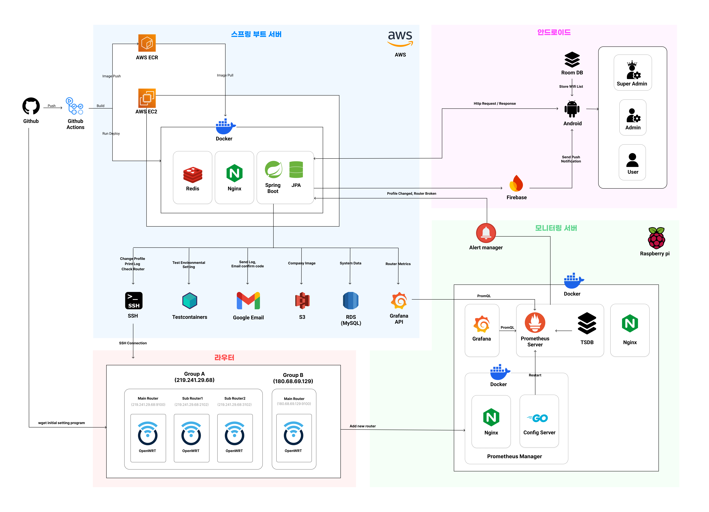

## 1. 프로젝트 소개
### 1.1. 배경 및 필요성
#### 1.1.1. 다중 공유기 제어 서비스의 부족
 이미 Cisco의 제품 중에는 공유기를 사용할 때, 제어 및 관리를 보장하는 제품이 있다. 여러 대의 공유기를 설치 및 사용하는 데에 도움을 주는 스위칭 허브라는 제품 역시 이미 존재한다. 그러나 이는 각각의 공유기를 제어하는 데에 제한되어 있으며, 여러 대의 공유기를 한 번에 제어하는 기능은 지원하지 않는다. 스위칭 허브도 공유기 여러 대를 설치하여 사용할 수 있도록 하는 데에 초점을 맞춘 제품이며, 고가의 제품이 아닌 모델은 관리자 모드를 지원하지 않기 때문에, 기업에서 관리하는 공유기가 30대 이상일 경우 각각의 공유기를 관리하는 데에 어려움이 따른다.

#### 1.1.2. 최적 Wifi 기준이 모호한 스마트폰 내 와이파이 연결 기능
안드로이드 시스템에서는 Wi-Fi에 접속할 때 현재 사용 가능한 Wi-Fi 목록을 사용자에게 표시해 주는데, 기본적으로 신호 세기가 가장 강한 Wi-Fi 순서대로 표시된다. 이때, 해당 네트워크가 얼마나 혼잡한지에 대한 여부는 고려되지 않기 때문에 많은 사람들이 접속하고 있어 빠른 인터넷 속도를 기대할 수 없지만 신호 세기가 강한 Wi-Fi에 연결되어 사용자가 양질의 인터넷을 사용하지 못하는 일이 생긴다.

One UI 5.0 이후 버전 안드로이드에서는 Intelligent Wi-Fi 기능을 지원하고 있다. Intelligent Wi-Fi 기능을 이용하면 현재 연결된 네트워크보다 빠르거나 안정적인 Wi-Fi로 자동 연결되도록 설정할 수 있다. 해당 기능을 사용하면 자동으로 최적의 Wi-Fi에 연결하는 것을 기대할 수 있지만, 최적의 Wi-Fi의 기준이 모호하며 자동으로 네트워크를 전환하는 과정에서 사용자가 원하지 않는 네트워크에 연결하게 되는 문제점 또한 존재한다.

#### 1.1.3. 네트워크 대역폭 병목현상
현재 대부분의 네트워크 환경에서는 다수가 접속할 경우 개인당 할당되는 대역폭이 급격히 줄어드는 문제가 발생한다. 네트워크는 제한된 대역폭을 여러 사용자에게 나누어 제공하기 때문에, 일정 수 이상의 사용자가 한꺼번에 접속할 경우 모든 사용자의 인터넷 속도가 느려지게 된다. 특히 기업이나 공공장소, 산업 환경의 네트워크에서는 여러 대의 디바이스가 동시에 네트워크에 접속하는 일이 빈번하며, 이에 따라 원활한 인터넷 사용이 어려워지는 경우가 많다. 이를 해결하기 위한 고성능 라우터 및 네트워크 관리 솔루션이 존재하지만, 대부분 비용이 고가인 데다 효율적인 대역폭 관리를 보장하는 기술적 한계가 여전히 존재한다.

### 1.2. 목표 및 주요 내용
본 과제는 OpenWRT를 이용하여 다중 공유기를 모니터링 및 제어할 수 있는 시스템을 개발하는 것을 목표로 한다. 네트워크 관리자는 안드로이드 애플리케이션에 로그인함으로써 다중 공유기 모니터링 및 제어 서비스를 통해 공유기 모니터링 및 관리의 효율을 올릴 수 있다. 또한, 다양한 상황에 최적화된 동작을 수행할 수 있도록 미리 정의해둔 공유기 설정 프로파일을 사용함으로써 네트워크 저하 현상을 해결하여 네트워크 연결 품질을 개선하거나 최대한 많은 사용자에게 일정한 네트워크 연결 품질을 제공하도록 할 수 있다. 

또한, 신호 세기만 고려하던 기존의 연결 가능 네트워크 리스트와 달리, 현재 연결할 수 있는 공유기 중에서 신호 세기, 작업량, 트래픽 등의 다양한 메트릭을 고려하여 최적의 Wi-Fi에 접속하는 알고리즘을 개발하여 사용자 측면에서 최적의 네트워크에 연결하는 것을 돕는다. 만약 사용자가 연결된 네트워크보다 연결 품질이 좋은 네트워크가 근처에 존재할 경우, 사용자에게 이것을 알리고 더 좋은 네트워크로 연결을 전환하도록 하는 기능을 제공한다.

본 과제에서는 다음 5가지를 핵심 기능으로 정의하였다.
- 공유기 통합 모니터링 서비스 개발
- 공유기 통합 프로파일링 관리 서비스 개발
- 관리자용 안드로이드 애플리케이션 개발
- 사용자 권한 설정 및 관리 시스템 개발 
- Wi-Fi 상태에 따른 최적의 네트워크 연결 서비스 개발(Hand-off)

## 2. 상세설계
### 2.1. 시스템 구성도

### 2.2. 사용 기술
| 기술명  | 사용처  | 설명 |
|:-:|:-:|:-:|
| OpenWRT  | Infra  | 라우터의 능동적인 제어를 위한 경량 리눅스 |
| Shell Script  | Infra  | 리눅스 동작 자동화를 위한 스크립트 |
| Docker  | Backend, Raspberry Pi  | 서버에서 백엔드, 모니터링 시스템을 컨테이너로 실행 |
| Docker Compose | Backend, Raspberry Pi  | 다양한 도커 옵션 및 종속성 설정 |
| Nginx  | Backend, Raspberry Pi  | 한 도메인에 대한 요청을 여러 도커 컨테이너에 분배하기 위한 툴 |
| Spring Boot  | Backend  | 다중 라우터 관리 서버 프레임워크 |
| AWS EC2  | Backend  | 다중 라우터 관리 서버 배포용 클라우드 인스턴스 |
| AWS RDS  | Backend  | 다중 라우터 관리 서버를 위한 메인 데이터베이스 |
| Redis  | Backend  | RDS - 관리 서버 사이 데이터베이스 성능 향상을 위한 캐싱 툴 |
| Prometheus  | Raspberry Pi  | 라우터 네트워크 관제를 위한 메트릭 데이터 수집 |
| Grafana  | Raspberry Pi  | 라우터 메트릭 데이터에 대한 시각화 및 알림 툴 |
| Golang  | Raspberry Pi  | Prometheus 설정 변경 API를 위한 서버 제작 |
| Jetpack Compose  | Android  | 사용자 및 관리자의 편의를 위한 안드로이드 앱 제작 |

## 3. 설치 및 사용 방법
### 3.1. 공유기 그룹

### 3.2. 백엔드

### 3.3. 라즈베리파이

### 3.4. 안드로이드

## 4. 소개 및 시연 영상
> 프로젝트에 대한 소개와 시연 영상을 넣으세요.

## 5. 팀 소개
> 팀원 소개 & 구성원 별 역할 분담 & 간단한 연락처를 작성하세요.